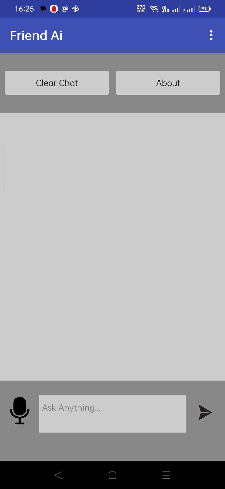
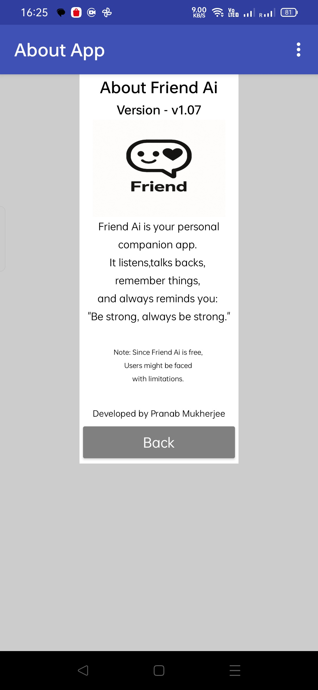

Friend AI 🤖

Your Personal Ai Companion App

✨ Features

- AI chatbot system
- Chat memory using TinyDB
- Thinking indicator
- Text-To-Speech greeting message 
- Persistent chats after reopening app
- Clear chat system
- Modern chat UI  

📥 Downloads

Version | Download 
 v1.07 | (https://github.com/Pranab-dev/friend-ai/releases/download/v1.07/FRIEND_AI.apk)

v1.06 | (https://github.com/Pranab-dev/friend-ai/releases/download/v1.06/FRIEND_AI.apk)

v1.05 | (https://github.com/Pranab-dev/friend-ai/releases/download/v1.05/FRIEND_AI.apk)

v1.04 | (https://github.com/Pranab-dev/friend-ai/releases/download/v1.04/Friend_Ai.apk)

v1.03 | (https://github.com/Pranab-dev/friend-ai/releases/download/v1.03/Friend_Ai.apk)

v1.02 | (https://github.com/Pranab-dev/friend-ai/releases/download/v1.02/Friend_Ai.apk)

v1.01 | (https://github.com/Pranab-dev/friend-ai/releases/download/v1.01/Friend_Ai.apk)

📱 Screenshots

## Main Chat Screen

## About Screen

🧰 Built With

- MIT App Inventor
- Android
- ChatBot component/API
  
🚧 Current Limitations

- ListView-based chat system
- Limited text formatting support
- Experimental memory systems

🚀 Roadmap

- [ ] Label-based chat system
- [ ] Better AI memory
- [ ] Media/file support
- [ ] AI image generation
- [ ] Improved formatting
- [ ] Better UI animations

📜 Changelog

See:
"CHANGELOG.md"

📌 Status

Currently in active development.

Latest stable version:

«v1.07»
